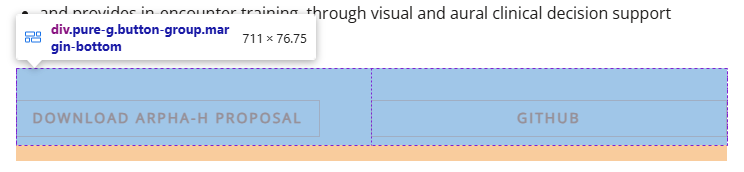

# QA Feedback Tracker

Feedback from Jen Patel via FigJam board review.

## Status Key
- [x] Fixed
- [ ] Pending
- [~] Partially fixed

---

## 1. AI Design Certification
- [x] Missing text in section 4 (wellness/medical world paragraph + bullet list)
- [x] Item 7 "The point" missing haiku-style linebreaks
- [x] "We're building this in the open:" should be smaller header (h3), not bullet
- [x] "Studies of AI..." quote moved to before item 4
- [x] "Trust grows..." quote added as standalone Quote at end

## 3. Human-Centered Design for AI
- [x] "Studies of AI..." should be a quote (blockquote) before section 3
- [x] "Trust grows..." missing standalone Quote at end
- [x] Both instances preserved (inline prose + featured quote)

## 4. Visual Storytelling with GenAI
- [ ] Not using same preview images for videos (noted, not critical)
- [x] Hotspots off — fixed with translate(-50%,-50%) + w-fit container
- [x] Hotspots move after click — fixed transition-colors
- [x] Mobile equation layout — responsive grid + spacing
- [x] Scene buttons — changed to tab style
- [x] 3D viewer border rounding removed
- [x] Text differences from Gatsby — removed extra "Navigate through our 3D hospital model..." paragraph from ModelViewerSection (not in Gatsby)
- [ ] Authors + contributors ordering consistency (no contributors on this page; AuthorSection secondary label "Designer/Engineer" vs Gatsby "GoInvo" is a global pattern, not VSG-specific)

## 6. Eligibility Engine
- [x] Doubled superscripts (sup "1" and "4") — removed duplicates
- [x] Quote "(3)" not a superscript — set refNumber=3

## 7. Fraud Waste Abuse in Healthcare
- [x] Missing haiku-style linebreaks in intro paragraph
- [x] "30%" heading alignment (sectionTitle → h2, left-aligned)

## 8. Augmented Clinical Decision Support
- [x] Button border: 2px → 1px
- [x] Button border color: #E36216 → #FFB992 (lighter orange)
- [x] Button padding: 12px 24px → 6px 16px
- [x] Button-group flex override removed (pure-g side-by-side works)
- [x] Missing disc bullet list styles added
- [x] Cagri Zaman and Mollie Williams author images broken (path needs cloudfrontImage)
- [x] Button hierarchy/spacing/uneven sizes — bumped font-size from 14px to 15px (matching Gatsby), added `button--block` to the ARPHA-H/Github button pair so both buttons fill their column to 50% width (were 320px vs 356px), and added 0.5rem column padding for a 16px gap between adjacent buttons.

## 9. Healthcare AI
- [x] Text rendered right of images instead of under — added a new `storyboard` layout option to the columns Sanity schema and updated the renderer to render storyboard items as a 2-column grid where each cell is image-on-top text-below. Consolidated the 6 separate storyboard columns blocks + 9 interleaved narrative paragraphs into a single columns(storyboard) block with 21 alternating image+text children. Each image groups with its following paragraphs as one cell, matching Gatsby's 2-column comic-strip layout.

- [x] Storyboard images rendering stacked instead of side-by-side — fixed columns renderer
- [ ] Not using same preview images for videos
- [x] Chat image too narrow — converted columns(2) wrapper to standalone image block with caption (Sanity content patch)
- [x] Text content differences — removed trailing space from "AI Image Generation" and "AI Text Generation" bold labels (was rendering as "Generation : One" instead of "Generation: One")
- [x] Authors + contributors ordering — moved Contributors block from content to specialThanks field (Authors now render BEFORE Contributors, matching Gatsby)

## 10. National Cancer Navigation
- [x] Links open in new tabs (global fix)
- [x] Authors listed vertically (linebreaks added)
- [x] Spaces between links and periods — stripped trailing space from "National Cancer Plan " and "CancerNavigator@goinvo.com " link spans (Sanity content patch)
- [x] Missing contributor links — root cause: the contributor block already had `markDefs` with the LinkedIn URLs but the spans weren't tagged with the marks. Applied the existing markDefs to Grace Cordovano / Wendi Cross / Daniel Ngo spans. Also added an optional `link` field to the `contributorCredit` schema and the AuthorSection now respects per-contributor `link` or falls back to `social.linkedin`.

## 12. Living Health Lab
- [x] Missing content after "Next Steps: Digital Design" (114 lines added)

## 17. Faces in Health Communication
- [ ] Layout differences make circles + text harder to follow
- [~] Weird amount of superscripts — block "Annals of Emergency Medicine" had 8 spurious superscripts (27,7,4,2,27,7,4,2) and a trailing space before comma; cleaned. Intro blocks "populations27" and "critical instructions275" superscripts removed (Gatsby has none). Also stripped trailing spaces from 13 spans immediately before sup marks (was rendering as "face. 20" instead of "face.²⁰").
- [ ] Another weird layout (Human Faces and Communication section)
- [x] "Humans are born to look at faces." — removed duplicate (text was inside a columns(2) image+text block AND as a standalone textCenter block; kept the textCenter block which already matches Gatsby's serif-center styling, removed the columns sidecar)
- [ ] Next sections became "salad" (broken layout)
- [ ] More layout, image + text mismatch
- [ ] Image sizes and layouts vary — prefer original design for balance
- [ ] Next section also doesn't work (Healthcare Graphics section)
- [ ] Some more layout issues in later sections
- [x] "Appendix. A Lean Experiment..." — added missing space after "Appendix." (was "Appendix.A Lean..."). Block was already an h2 header.

## Global Issues
- [x] Paragraph margin-top: 0 → my-4 (matching Gatsby 1em)
- [x] External links auto-open in new tabs
- [x] Firefox banner seam — merged to single image
- [x] Mobile vision hero — 3 stacked mobile images
- [x] Duplicate banners on 5 legacy pages (zika, redesign-democracy, bathroom, oral-history, print-big)
- [x] 32 duplicate sectionTitle headings removed from case studies
- [x] Drafts section showing on public site — fixed condition
- [x] Orange bullets on enterprise/government results sections

## 18. Health Design Thinking
- [x] All-caps issue — PortableTextRenderer columns gallery was rendering bold-caption text as `font-semibold uppercase`. Gatsby has `font-weight: 400, text-transform: none`. Changed to render through PortableText component (preserving link marks) with just bold styling, no uppercase.

## 23. Physician Burnout
- [x] Mobile version of contributors/burnout illustration should show text list of contributors — added a numbered list with 8 items (and nested bullets) before the desktop illustration. Matches Gatsby's mobile-only list with bold keywords and sub-bullets for details.

## hGraph (Case Study)
- [x] All-caps too much — category tags were rendered as uppercase pills ("PATIENT ENGAGEMENT", "OPEN SOURCE", "HEALTHCARE"). Gatsby renders them as plain comma-separated text after "Tags:" label. Changed CaseStudyContent to match.

## 24. Determinants of Health
- [x] Why different style of buttons? — changed `.determinants-of-health .button--secondary` from filled teal `#007385` to outlined orange (transparent bg, `#E36216` text, `1px solid #FFB992` border, `6px 16px` padding, 15px font) matching Gatsby exactly
- [x] Wrong icons for the chart — replaced 5 placeholder generic icons with the actual Gatsby SVGs (Individual Behavior, Social Circumstances, Genetics & Biology, Medical Care, Environment). Decoded from base64 in Gatsby HTML and saved to public/images/vision/determinants-of-health/.
- [ ] Chart looks different from Gatsby (our custom SVG donut vs react-google-charts)
- [x] Big sans-serif header "Individual Behavior" — reduced from text-xl (20px) to 1.17em (~18.72px matching Gatsby's h3 default)
- [x] Little sub-headers (Psychological Assets, etc.) — changed from default serif 24px to font-sans text-base font-bold (16px, matching Gatsby's h4)
- [x] Blue-on-blue contrast — `.background--blue` was `#dff0f5` (distinctly blue); Gatsby uses `#f8fafe` (nearly white). Changed to match. The gray text now has proper contrast.
- [x] Missing Edwin's and Bryson's headshots — added 'Edwin Choi' and 'Bryson Wong' mappings to team-headshots.ts (both CloudFront images exist: headshot-edwin-choi.jpg and headshot-bryson-wong.jpg).

## 25. Coronavirus (COVID-19)
- [x] Chart shows massive difference/undercount — replaced March 2020 snapshot data (111k cases) with WHO final figures (704,753,890 cases / 7,010,681 deaths). Updated y-axis tick logic to handle large numbers (auto-scales to 800M with "M" suffix), updated formatCompact to handle billions, updated source caption to "Data through 2024. Source: WHO COVID-19 Dashboard."
- [x] Missing bullets from timeline — Tailwind reset was setting list-style-type: none on `.corona-timeline .timepoint ul`. Added `list-style-type: disc` and `display: list-item` to restore bullets on 7 Jan / 30 Jan / 31 Jan timeline entries.
- [x] Icons should be vertically centered with text, with extra space below — added `vertical-align: middle` to both `.pro-con-icon` and `.pro-con p` (was defaulting to baseline, making icons appear above text). Added `margin-bottom: 1.5rem` to `.pro-con` for breathing room between rows.

## 28. Who Uses My Health Data
- [x] Missing download poster link (moved buttonGroup from index 10 to right after poster image)
- [x] Image could be wider — changed poster image size from default to `bleed` (full viewport width, matching Gatsby 1250px)
- [x] Consider removing orange border for consistency — changed border from `peach` to `none`

## 29. openPRO
- [ ] Some extra text bopping around (layout shifts)
- [ ] Left-aligned icons works better (currently centered?)
- [x] Bullets for "limitations" got misplaced — 3 limitations bullets (Limited portal integration, Siloed PRO platforms, No data standards) were positioned under "The current landscape" intro instead of under "Limitations" h4. Moved them to right after the Limitations heading. Sanity content patch.
- [x] "this 18 is not necessary" — removed sup "18" from "Lack of resources... Boston:" bullet (was hanging awkwardly between bullet text and the following blockquote)
- [x] Button in the wrong spot — moved "Contribute on GitHub" buttonGroup from position 58 (after the numbered list of projects) to position 52 (directly after the openPRO main graphic image) matching Gatsby
- [ ] Text styling reads better originally — use soft line breaks instead of new paragraphs
- [ ] Nested bullet styles too slight/glitchy — not noticeable or effective
- [x] Authors should be listed as Contributors — Daniel Reeves stays as sole Author; Sharon Lee, Jen Patel, Juhan Sonin moved to contributors field (matches Gatsby which lists Daniel as Author and the other three as Contributors).

## 52. MASS SNAP
- [x] Missing solution header — inserted sectionTitle "Solution" before "Simple and accessible" block
- [x] Missing results header — inserted sectionTitle "Results" before "The redesigned application was deployed..." block
- [x] Missing care plans feature card for "up next" — added Care Plans feature reference to MASS SNAP upNext array (now has 3 cards: Inspired EHRs, Determinants of Health, Care Plans)

## 51. Maya EHR
- [x] Missing solution and results headers — inserted sectionTitle Solution before "End-to-end workflow designed" h4 and Results before "Shipped software" h4

## 50. MITRE SHR
- [x] Missing solution header — inserted sectionTitle Solution before "Create a visual language for the SHR" h4
- [x] Missing results header — inserted sectionTitle Results before "HL7/FHIR adoption" h4

## 49. All of Us
- [ ] Not a fan of how header images are cropped — losing a lot at any browser size (global hero crop issue, would need hero component redesign)
- [x] Missing an image — inserted "02-where-goinvo-fits-in-the-aou.jpg" between "The program is an ambitious..." paragraph and "Participants who join contribute..." (image existed in Sanity asset library but no block referenced it)
- [x] Could images make use of more of the width? — changed all 6 (now 7) body images from size=large (533px) to size=full (711px) matching Gatsby
- [x] Missing results header — inserted sectionTitle Results before "Impacting 750k..." paragraph
- [x] References had duplicated link text — cleaned URL from title text

## 46. Ipsos Facto
- [ ] Missing image (image counts ~match Gatsby; videos vs poster images may explain the diff)
- [x] Feature cards — instead of just "Feature" label — for vision features, the `client` field is the literal string "Feature". CaseStudyCard now hides client for vision section and falls back to `description` when caption is empty. Affects all upNext sections globally.

## 47. Prior Auth
- [x] Bigger images needed — changed all 6 body images from size=large (75% of container = 533px) to size=full (100% = 711px), matching Gatsby exactly. Sanity content patch.
- [x] Missing solution header — inserted sectionTitle Solution before "Patient Information Upfront" h4 (also removed erroneous mid-page "Results" h3 that was added in commit 652de04 but isn't in Gatsby)

## 44. Understanding Ebola
- [x] Header duplication — fixed in commit 652de04 (removed SetCaseStudyHero since page has own header)

## 43. Redesign Democracy
- [x] Really thin callouts are painful to read — raised stack-breakpoint for `.image-caption-side` from 768px to 1024px so the 35%-width caption stacks below the image earlier instead of getting squeezed
- [x] Columns get thinner and text doesn't really fit — same fix; also raised `.aside-image` breakpoint from 860px to 1100px so the 40% sidebar stacks earlier
- [~] Need more graceful breakpoint — addressed above with earlier stack breakpoints
- [x] Missing image (blank space where Handheld Voting System image should be) — root cause: VotingCarousel uses Embla horizontal scroll where off-screen slides are translated outside the viewport. Next.js `<Image>` lazy-loads via IntersectionObserver and never fired for transformed slides, so the 11 voting screenshot images (p1.1, p1.2, p2.1...p5.phone) never requested. Added `loading="eager"` and `unoptimized` to the carousel images so they load immediately.
- [ ] Image overlay can't be done — use image first then text, or side by side
- [ ] Text too wide and image too big in one section

## 41. Bathroom to Healthroom
- [ ] Long scroll of images vs slider makes you lose timeline context and takes forever to get to text
- [x] Needs horizontal padding (text running edge to edge) — added 1.5rem (mobile) / 3rem (desktop) horizontal padding to article paragraphs and list items
- [x] Missing interactive piece — restored the dates slider (1985/2015/2025 sensor evolution) as an interactive client component (DateSlider.tsx) replacing the static stacked grid. Updated CSS to support button elements alongside legacy `<a>` elements.
- [ ] Another piece doesn't work as-is (layout/interactive section broken)

## 40. Disrupt
- [x] Sometimes clicking "Next part" link goes back to top of current part — changed BottomNav from plain `<a>` to Next.js `<Link>` with explicit `window.scrollTo({ top: 0 })` onClick to force scroll-to-top after navigation. The intermittent behavior was likely the transition system preserving scroll position from the previous page.

## 39. Healing US Healthcare (MAJOR — interactive charts missing)
- [ ] Chart didn't make it over (map/spending chart) — major rebuild needed
- [ ] Another chart bites the dust (healthcare spending bar chart) — major rebuild needed
- [ ] The OG timeline is broken anyway (shows error on Gatsby too)
- [ ] This chart is gone gone gone (another chart completely missing) — major rebuild needed
- [~] Missing content section (PARTICIPATE / Give Feedback section) — section already exists in code; added social share links (Facebook/Twitter/LinkedIn) that were missing from the Share row
- [~] Also missing content (PARTICIPATE section + CREATING section) — Participate section exists; Creating section may refer to "Creators" h2 which also exists

## 38. Digital Healthcare 2016
- [x] Duplication of the header — fixed in commit 652de04 (removed SetCaseStudyHero)
- [x] Spacing at the top is too tight — added mt-8 (md:mt-12) to the top of the page wrapper for breathing room above the title
- [x] Use standard Authors component — replaced custom .contributor / .contributors-box layout (4 contributors with hardcoded images, h3 roles, twitter handles) with the shared `<Author>` component (passes role via `company` prop, twitter link via children). Added section heading "Contributors" for consistency.

## 37. Understanding Zika
- [x] Header heights for "Treatment" sections — added br+nbsp to "Treatment for Adults" to match "Treatment for Pregnant Women" wrap height
- [x] Number the references (added list-decimal class to ol)

## 36. Care Plans Series (MAJOR — multi-part page with extensive issues)
### Part 1 (Overview)
- [x] Different header — restructured Part 1 hero to use the same `careplans-hero` component as Part 2 / Part 3, with the home_hero.jpg as background and CARE PLANS title overlaid in white serif text. Removed the redundant SetCaseStudyHero (which was using a different image — care-plans-featured2.jpg — that the global PersistentHero was rendering above the page hero, creating a stacked-hero appearance).
- [~] Lost the original design, kind of blah — improved with hero overlay matching Parts 2/3
- [x] Broken "Work Together" section — added missing intro line ("Want to take your healthcare or care plan product to the next level? Contact the authors at GoInvo:"), swapped column order so image is LEFT and contact info is RIGHT (matching Gatsby), removed gray background and rounded corners on image
- [x] Missing author images — author/contributor images use `/old/images/...` paths but cloudfrontImage() prepends the CloudFront CDN domain which 404s for `/old/` paths. Changed all 3 author images and 7 contributor images to use direct `https://www.goinvo.com/old/...` URLs.
- [x] Link to first part overview — changed nav from `#part1` hash anchor (which scrolled within the same page) to `/vision/care-plans` (the root page IS the Part 1 overview content, so it links to itself as a real route). Part 2 and Part 3 already link here correctly.

### Part 2 (Current Landscape)
- [x] Missing header — hero background was pointing to non-existent `/part2/hero_bg.jpg`. Changed to the actual file `/FeatureBanner_v02_back.jpg` (the brick scene with care plan flow chart). Hero now displays correctly.
- [x] Images are too far from the text — removed the separate desktop journey map image strip (which stacked all 7 images above the text steps). Each process-step now displays its image inline directly above its description. Added `.step-image` CSS for inline rendering and `loading="eager"` + `unoptimized` to bypass Next.js image lazy loading.
- [ ] Missing some columns
- [ ] Missing the context/position the hotspots provide (interactive elements lost)
- [ ] Can't do image text overlay but cycle image could be bigger
- [x] Table doesn't work on mobile — `.product-matrix-wrapper` already had horizontal scroll. Added gradient fade hints on edges and a "↔ Scroll" hint above the table on mobile screens (≤768px) to indicate the table scrolls horizontally.
- [ ] Image removed on mobile (not worth keeping gears without overlay)

### Part 3 (The Future)
- [x] Different header — hero background was pointing to non-existent `/part3/hero_bg.jpg`. Changed to the actual file `/part3/hero_image.jpg` (the illustrated street scene). Hero now displays correctly.
- [x] Can remove "Photo by Philips Communications" since bg photo wasn't pulled in — removed the caption from data-rich section
- [x] Text below can be wider, or use 2-column layout like sections above/below — restructured the data-rich section to use the same 1+2 column grid pattern as sections above/below: quote in left column, body text in right 2-column span (was previously col-span-2 with empty hidden md:block sidebar, leaving an awkward gap on the right).
- [x] Images could be bigger — slider works but doesn't look as nice as original — bumped slide-image-card max-width from 500px to 760px in careplans.css and individual image max-w from md/lg to 2xl/3xl in part-3 page. Slides now display closer to original poster sizes. Also fixed an Embla carousel lazy-loading bug: only 2/12 carousel images were actually loading because Next.js `<Image>` IntersectionObserver doesn't fire for slides translated outside the viewport. Added `loading="eager"` and `unoptimized` to all 12 carousel `<Image>` components in part-3 (Digital is Better, Empowering, Dynamic carousels). Now all 12 images load.
- [x] "Doesn't work on white bg" — dark-themed sections losing their background color — added all 7 section background images (part1_bg.png through part7_bg.png) to sections digitized/standardized/data-rich/empowering/care-team/dynamic/health-shift, restoring the colored teal/dark blue backgrounds

## 35. Killer Truths
- [x] Using an image but screen readers can't read it — replaced static PNG chart with accessible HTML table containing all 16 causes of death (Heart Disease 4.85M to Terrorism 52). Bars are CSS-styled proportional widths. Screen readers parse the data semantically.
- [x] Missing some of the stats (content not fully ported) — all 16 causes now visible as text in the table
- [x] Icons are misaligned — accessible chart approach makes this moot

## 33. Open Source Healthcare
- [~] Different headers? — h1/h2/h4 sizes and fonts match Gatsby exactly (Adobe-Jenson-Pro 36px / 24px / Open Sans 16px). User's complaint may have been about poetry block formatting which is now fixed via line break splits.
- [x] Lost the Juhan haiku-ness — added line breaks to "Here in the US, healthcare is..."
- [x] OSH poetry blocks — split 4 long paragraphs into properly line-broken text matching Gatsby's serif typography

## 32. Loneliness in Our Human Code
- [x] Missing stats — converted "Social isolation costs us..." paragraphs into a results block with "8 years" and "$6.7B" big stats matching Gatsby's hero stats
- [ ] Images exist but are displaced/wrong position (would require restructuring content blocks)

## 31. Virtual Care
- [ ] Missing the Top 15 encounters breakdown chart (D3 chart, would need rebuild)
- [ ] Missing time to diagnosis chart (D3 chart, would need rebuild)
- [x] Missing bullets under "care must go virtual" — added 3 missing bullets (better access/cost/outcomes; clinicians provide timely care; personalized medicine and services)
- [x] Cameron missing from authors — created teamMember `external-cameron-gettel` for Cameron Gettel (Yale University) and added him to virtual-care authors

## 78. Studio Timeline
- [x] Link to oral history doesn't work — fixed in commit 652de04 (/an-oral-history → /oral-history-goinvo)

## Script Improvements Needed
- [ ] batch-verify should also compare MOBILE viewport (375px) not just desktop
- [ ] page-tree.ts should detect broken/unloaded images (naturalWidth === 0)
- [ ] page-tree.ts should detect missing line breaks (text has \n on Gatsby but not on Next.js)
- [ ] page-tree.ts should compare button padding and border-width (added to batch-verify but not page-tree)

## Pages with Major Remaining Work
1. **Faces in Health Communication** — extensive layout issues throughout, image+text pairing broken in multiple sections. This page needs a deep re-port from the Gatsby source.
2. **Healthcare AI** — chat image width, video preview images, text differences
3. **National Cancer Navigation** — spacing issues, contributor links
4. **Health Design Thinking** — all-caps issue
5. **Physician Burnout** — mobile contributor illustration
